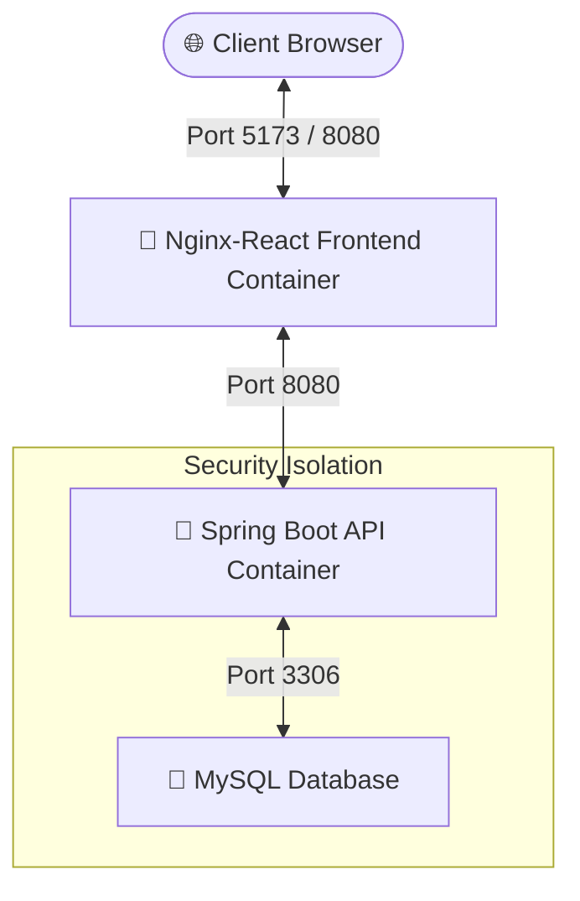

# DevHub 2.0 - 3-Tier DevSecOps Community Platform 🚀

[](https://github.com/kartavynirwel-code/DevHub2.0/actions)


DevHub 2.0 is a highly secure, containerized, and orchestrated 3-tier developer discussion portal (Reddit-inspired) built to showcase modern **DevSecOps and GitOps** practices. The architecture splits the original monolith into a decoupled **React SPA frontend** (hosted via Nginx) and a **Spring Boot REST backend** backed by **MySQL**. 

This repository serves as a production-grade portfolio demonstrating Infrastructure-as-Code (IaC), Kubernetes state orchestration, network isolation, and a security-first CI/CD workflow.

---

## 🏗️ System Architecture

The platform follows a classic 3-tier web architecture hardened with secure runtime parameters:



* **Frontend:** React (Vite) styled with a dark-theme-first Obsidian & Crimson Red layout. Served via `nginx-unprivileged` running as User `101` (listening internally on Port `8080`) to enforce non-root boundaries.
* **Backend:** Spring Boot REST API with stateless **JWT Bearer Token** authentication, BCrypt encryption, custom thread-safe database transaction flushes, and dynamic user karma synchronization.
* **Database:** MySQL for both local development and Kubernetes (EKS) cloud deployments (leveraging AWS EBS StorageClass gp3 for state persistence).

---

## 📂 Repository Layout

```text
DevHub2.0/
├── .github/workflows/       # GitHub Actions DevSecOps CI/CD pipeline definition (Java + Node)
├── backend/                  # Spring Boot REST API (Java 21)
│   ├── src/                  # Source files (Entities, Repositories, JWT Filters, Controllers)
│   ├── Dockerfile            # Multi-stage JDK 21 compilation container image (unprivileged)
│   └── pom.xml               # Maven builds & JJWT dependency tree
├── frontend/                 # React SPA Client
│   ├── src/                  # Components, Hooks, Custom Code Parser, and Obsidian styling
│   ├── Dockerfile            # Secure multi-stage build using unprivileged Nginx (Port 8080)
│   ├── nginx.conf            # Nginx config handling client-side SPA routing & API proxying
│   └── package.json          # Node dependencies
├── k8s/                      # Kubernetes Orchestration Manifests (YAMLs)
│   └── devhub.yaml           # Namespace, Opaque Secrets, gp3 StorageClass, PVCs, Deployments & NetworkPolicies
├── terraform/                # Infrastructure-as-Code (IaC)
│   ├── main.tf               # AWS EKS cluster, Node Groups, Karpenter & VPC provisioning
│   ├── variables.tf          # Configurable deployment inputs
│   └── terraform.tfvars      # Local deployment overrides
├── .checkov.yml              # Checkov compliance scan exceptions configuration
├── .gitignore                # DevSecOps-aligned git filtering rules (zero leakage policy)
└── docker-compose.yml        # Local multi-container development orchestrator
```

---

## 🛡️ DevSecOps & Security Hardening Features

This project implements advanced safety guidelines across application, delivery, and infrastructure layers:

### 1. Shift-Left Security CI/CD Pipeline (GitHub Actions)
The pipeline scans code, dependencies, configurations, and containers on every push:
* **Linting:** Validates React code with ESLint, analyzes Java backend files during compilation, and checks Dockerfile instructions with `Hadolint` (failing on unsafe directives).
* **Software Composition Analysis (SCA):** Audits frontend npm dependencies (`npm audit`) and backend Java dependencies to detect and stop builds on high-severity CVEs.
* **IaC Compliance Scans (Checkov):** Scans Kubernetes manifests (`k8s/devhub.yaml`) and Terraform files to prevent security misconfigurations (e.g., public endpoints, privileged containers, missing resource tags).
* **Container Vulnerability Scanning (Trivy):** Scans compiled backend and frontend images for OS and library vulnerabilities, terminating builds if critical vulnerabilities exist.
* **GitOps Automations:** Upon successful commits to the `main` branch, the pipeline automatically updates the container image tags inside `k8s/devhub.yaml` with the commit hash, triggering rolling updates in EKS.

### 2. Hardened Kubernetes Pod Security
* **Network Isolation (NetworkPolicies):** Restricts network access. The MySQL database only accepts inbound traffic from the backend service on port `3306`. The backend only accepts traffic from the frontend on port `8080`.
* **Non-Root Execution Contexts:** Containers run with unprivileged user IDs (e.g. Nginx runs as `101`, Java JRE runs as `1000`). Root privileges (`runAsNonRoot: true`) and privilege escalation (`allowPrivilegeEscalation: false`) are disabled.
* **Immutable Root Filesystem:** Backend containers run with a read-only filesystem (`readOnlyRootFilesystem: true`) to prevent attackers from executing local write exploits.
* **Least-Privilege Capabilities:** Unused Linux kernel capabilities are explicitly dropped (`capabilities.drop: [ALL]`).
* **Safe Mounting:** Auto-mounting Kubernetes API credentials (`automountServiceAccountToken: false`) is disabled for application pods that do not need to query the Kubernetes control plane.

---

## ⚙️ Running Locally

### Prerequisites
* Java 21 & Maven 3.9+
* Node.js 20+
* Local MySQL Instance OR Docker installed

### Option A: Local Host Execution (For Active Development)

1. **Database Setup:** Run MySQL locally and execute:
   ```sql
   CREATE DATABASE devhub_db;
   ```
2. **Launch Backend REST API:**
   ```bash
   cd backend
   mvn spring-boot:run
   ```
3. **Launch React Client:**
   ```bash
   cd frontend
   npm install
   npm run dev
   ```
   Navigate to `http://localhost:5173`.

### Option B: Docker Compose (Unified Environment)
Orchestrates backend, frontend, and MySQL in a containerized environment with database healthchecks:
```bash
docker compose up --build
```
Open `http://localhost:5173` to test the application.

---

## ☸️ Kubernetes Deployment (AWS EKS)

The single-file manifest `k8s/devhub.yaml` provisions the namespace, storage, secrets, and pods:

### 1. Provision Cloud Infrastructure (Terraform)
Deploy AWS EKS, Karpenter nodes, and networking elements:
```bash
cd terraform
terraform init
terraform plan
terraform apply --auto-approve
```

### 2. Deploy Manifests to EKS
Configure your cluster context and apply the manifests:
```bash
kubectl apply -f k8s/devhub.yaml
```

### 3. Port-Forward to Access Application
Since LoadBalancers can be restricted in development accounts, secure internal access using port forwarding:
```bash
# Forward frontend traffic locally
kubectl port-forward svc/devhub-frontend 8080:80 -n devhub
```
Navigate to `http://localhost:8080` in your web browser.

---

## 🛠️ DevSecOps Pipeline Stages

The GitHub Actions pipeline automates delivery checks sequentially:

```text
[Push/PR] ──► 1. 🔍 Linting (Hadolint + ESLint)
               └──► 2. 🛡️ SCA Security Audits (npm audit + Maven Dependency Scan)
                     └──► 3. 🏗️ IaC Scans (Checkov)
                           └──► 4. 🐳 Multi-Stage Docker Builds (provenance + SBOM)
                                 └──► 5. 🔬 Image Scans (Trivy)
                                       └──► 6. 🚀 GitOps Update (Auto-patch Manifests)
```

To run checks locally, execute:
* **Trivy Image Scan:** `trivy image devhub-backend:latest`
* **Checkov Manifest Scan:** `checkov -d k8s/`
* **Hadolint Dockerfile Scan:** `hadolint backend/Dockerfile`
