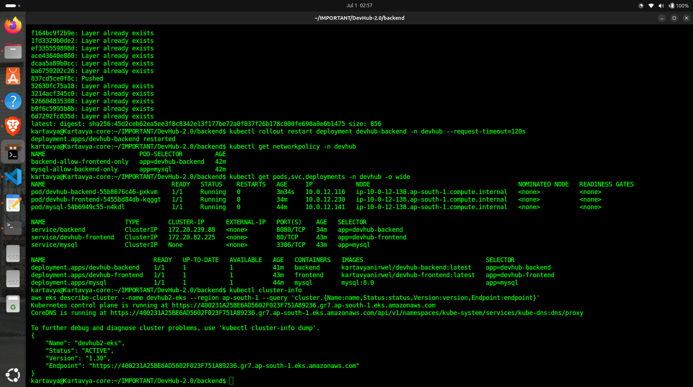
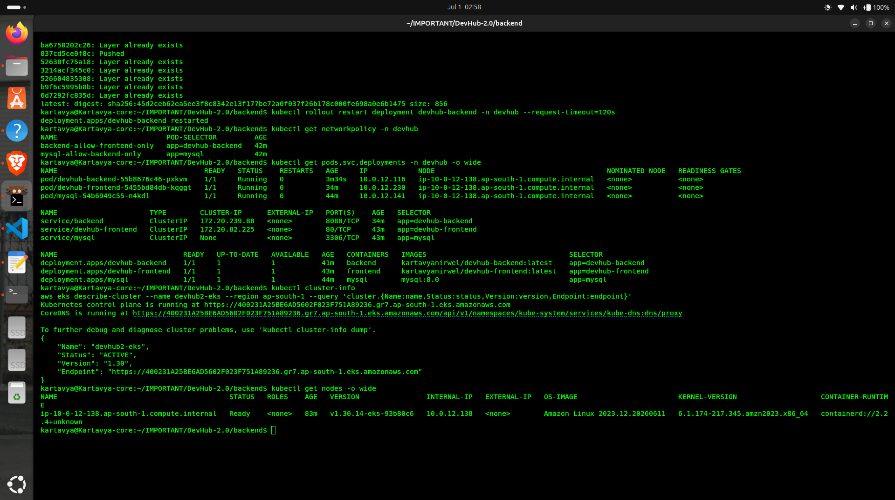
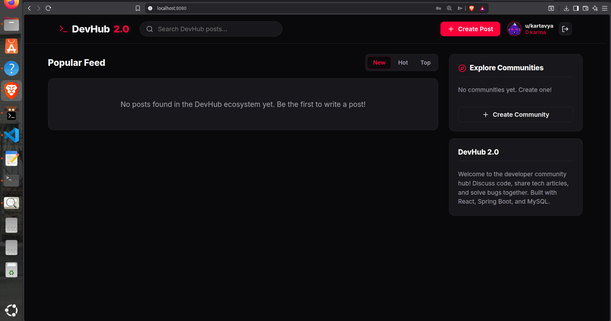

# DevHub 2.0 - 3-Tier DevSecOps Community Platform 🚀

[](https://spring.io/projects/spring-boot)
[](https://react.dev/)
[](https://aws.amazon.com/eks/)
[](https://www.terraform.io/)
[](https://www.docker.com/)

DevHub 2.0 is a Reddit-inspired developer discussion platform, rebuilt as a **decoupled 3-tier architecture** to demonstrate production-grade DevSecOps and GitOps practices. The original Spring Boot + Thymeleaf monolith was split into a **React SPA frontend** (served via unprivileged Nginx) and a **Spring Boot REST API backend** (JWT auth) backed by **MySQL**, all deployed on **AWS EKS** provisioned entirely through **Terraform**.

---

## 🏗️ System Architecture

```
                              ┌─────────────────────┐
                              │   Client Browser     │
                              └──────────┬───────────┘
                                         │
                              ┌──────────▼───────────┐
                              │  Nginx (unprivileged) │   Public/Private Subnet
                              │  React SPA :8080      │   (EKS Pod)
                              └──────────┬───────────┘
                                         │ proxy_pass /api
                              ┌──────────▼───────────┐
                              │  Spring Boot REST API │   Private Subnet
                              │  JWT Auth :8080        │   (EKS Pod)
                              └──────────┬───────────┘
                                         │ NetworkPolicy-restricted
                              ┌──────────▼───────────┐
                              │  MySQL 8.0             │   Private Subnet
                              │  gp3 EBS-backed PVC     │   (EKS Pod)
                              └────────────────────────┘
```

- **Frontend:** React (Vite), served via `nginx-unprivileged` running as non-root user `101`.
- **Backend:** Spring Boot REST API, stateless JWT auth, BCrypt password hashing, Hibernate/JPA with MySQL.
- **Database:** MySQL 8.0 on a `gp3` EBS-backed `PersistentVolumeClaim`.
- **Infrastructure:** Custom VPC (2 public + 2 private subnets, single NAT Gateway), AWS EKS, Terraform-managed end-to-end.

---

## ☁️ Infrastructure (Terraform → AWS EKS)

All infrastructure is provisioned declaratively — no manual console clicks.

| Component | Details |
|---|---|
| VPC | Custom, 2 public + 2 private subnets across 2 AZs |
| NAT | Single NAT Gateway (cost-optimized for a portfolio deployment) |
| EKS Cluster | `v1.30`, public + private API endpoint access |
| Node Group | Managed node group, `c7i-flex.large` (2 vCPU / 4 GiB) |
| Add-ons | `aws-ebs-csi-driver` (PVC support), `vpc-cni` with NetworkPolicy enforcement enabled |
| IAM | Least-privilege roles for cluster control plane and worker nodes |

```bash
cd terraform/
terraform init
terraform plan
terraform apply
aws eks update-kubeconfig --region ap-south-1 --name devhub2-eks
```

> **Cost note:** EKS control plane + NAT Gateway are billed regardless of usage. This project is deployed on-demand for testing/demos and destroyed afterward via `terraform destroy` — it is not kept running 24/7.

---

## ☸️ Kubernetes Deployment

```bash
kubectl apply -f k8s/manifests/01-namespace-secret.yaml
kubectl apply -f k8s/manifests/02-mysql.yaml
kubectl apply -f k8s/manifests/03-backend-frontend.yaml
kubectl apply -f k8s/manifests/04-networkpolicy.yaml
```

### Security hardening applied to every pod
- `runAsNonRoot: true` — Nginx runs as UID `101`, Spring Boot/Tomcat as UID `1000`
- `allowPrivilegeEscalation: false`
- `readOnlyRootFilesystem: true` with explicit `emptyDir` volumes for the few paths each runtime needs to write to (Nginx cache/run, Tomcat `/tmp`)
- `capabilities.drop: ["ALL"]`
- `automountServiceAccountToken: false` for app pods that don't need the Kubernetes API
- **NetworkPolicies** restricting traffic: MySQL only accepts connections from the backend; the backend only accepts connections from the frontend

---

## 📸 Proof of Deployment

**Live cluster — pods, services, deployments, NetworkPolicies, and EKS cluster status:**



**EKS node details and cluster API confirmation:**



**Application working end-to-end — authenticated session on the deployed app:**



---

## 🐛 Real Debugging Journey

This section documents actual issues hit during deployment — not a polished happy-path. Each one reflects a genuine production-relevant gotcha.

| Issue | Root Cause | Fix |
|---|---|---|
| `aws_eks_addon.ebs_csi` stuck creating, `no EC2 IMDS role found` | EKS managed node groups default IMDS hop limit to `1`, blocking pod-level (not just host-level) access to instance metadata | Added a custom `aws_launch_template` with `http_put_response_hop_limit = 2` |
| Frontend pod `CrashLoopBackOff`, exit code 1 | `readOnlyRootFilesystem: true` blocked Nginx from writing to `/var/cache/nginx`, `/var/run` | Added `emptyDir` volumes for Nginx's runtime write paths |
| Backend pod `CrashLoopBackOff`, `WebServerException: Unable to create tempDir` | Same root cause as above — Tomcat needs to write to `/tmp` at startup | Added an `emptyDir` volume mounted at `/tmp` |
| Frontend crashed at boot: `host not found in upstream "backend"` | `nginx.conf`'s hardcoded upstream hostname (`backend`) didn't match the Kubernetes Service name (`devhub-backend`) | Renamed the backend Service to `backend` to match the baked-in Nginx config |
| Signup/Login returned `403 Forbidden` despite `permitAll()` on `/api/auth/**` | Spring Security's `CorsFilter` evaluates **before** authorization rules; `localhost:8080` (the port-forward origin used for testing) wasn't in the backend's `allowedOrigins` list | Added `http://localhost:8080` to `SecurityConfig.java`'s CORS configuration |
| `kubectl apply` repeatedly timed out (`context deadline exceeded`) | Unstable local network (33% packet loss measured via `ping`), not a cluster issue | Split the manifest into smaller files, applied with `--request-timeout=300s`, verified each resource individually before retrying |
| `npm ci` failed during Docker build: lock file out of sync | `package.json` was edited without regenerating `package-lock.json` | `rm -rf node_modules package-lock.json && npm install` to regenerate a synced lock file |
| Gitleaks blocked commits for `terraform.tfstate` and placeholder secrets | `.gitignore` pattern was case-sensitive (`terraform/` vs actual `Terraform/` folder); demo secret values still matched entropy-based detection rules | Fixed `.gitignore` to be case-insensitive for the Terraform folder; moved real K8s secrets out of version control into a `.example` template |

**Key takeaway from this exercise:** `readOnlyRootFilesystem: true` is a strong security control, but every runtime (Nginx, Tomcat/JVM) has its own set of paths it needs to write to at startup. Test containers locally with `docker run --read-only` before deploying to catch these early, rather than debugging it pod-by-pod in the cluster.

---

## ⚙️ Running Locally

### Prerequisites
- Java 21 & Maven 3.9+
- Node.js 20+
- Docker

### Docker Compose (recommended for local dev)
```bash
docker compose up --build
```
Open `http://localhost:5173`.

---

## 🛡️ DevSecOps Pipeline

GitHub Actions CI/CD pipeline runs on every push:

```
[Push/PR] ──► 1. 🔍 Linting (Hadolint + ESLint)
               └──► 2. 🛡️ SCA Audits (npm audit + Maven dependency scan)
                     └──► 3. 🏗️ IaC Scans (Checkov on Terraform + K8s manifests)
                           └──► 4. 🐳 Multi-Stage Docker Builds
                                 └──► 5. 🔬 Image Scans (Trivy)
                                       └──► 6. 🔐 Secret Scans (Gitleaks)
```

Run checks locally:
```bash
trivy image kartavyanirwel/devhub-backend:latest
checkov -d terraform/
checkov -d k8s/
gitleaks detect
hadolint backend/Dockerfile
```

---

## 📂 Repository Layout

```
DevHub-2.0/
├── backend/                  # Spring Boot REST API (Java 21)
├── frontend/                 # React SPA
├── terraform/                # VPC, EKS, IAM, add-ons - all infra as code
├── k8s/manifests/            # Namespace, Secret, MySQL, Backend, Frontend, NetworkPolicies
├── screenshots/              # Deployment proof
├── docker-compose.yml        # Local dev orchestration
└── .gitleaks.toml            # Secret-scanning allowlist config
```

---

## 🧰 Tech Stack

**Backend:** Java 21, Spring Boot 3.3, Spring Security (JWT), Hibernate/JPA, MySQL 8.0
**Frontend:** React (Vite), Nginx (unprivileged)
**Infrastructure:** Terraform, AWS EKS, AWS VPC, IAM
**DevSecOps:** Gitleaks, Trivy, Checkov, Hadolint, GitHub Actions
**Containerization:** Docker (multi-stage builds), Docker Hub
